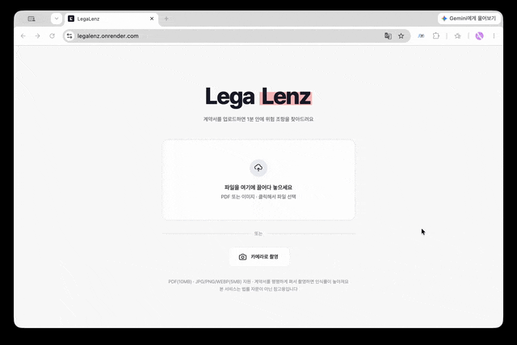

# LegaLenz

> 계약서 속 독소 조항을 찾아내고, 대안 문구까지 제안하는 계약서·약관 자동 리스크 분석 AI 서비스

계약서를 PDF 또는 이미지로 업로드하면 조항 단위로 리스크 등급(High / Other)을 분류하고, 공정거래위원회 표준계약서를 근거로 대안 문구까지 자동 제안합니다.



[발표자료 보기](./docs/presentation.pdf)

---

## 주요 기능

- **PDF / 이미지 업로드** — PDF 또는 계약서 촬영 사진을 업로드
- **자동 텍스트 추출** — PDF는 PDFMiner, 이미지는 EasyOCR(한국어 + 영어)로 텍스트 추출
- **조항 단위 자동 파싱** — 조항 경계를 감지해 분리
- **위험 조항 자동 분류** — 각 조항을 High / Other로 분류하고 하이라이트로 즉시 표시
- **근거 기반 대안 문구 생성** — 공정위 표준계약서 RAG 검색 결과를 근거로, 왜 위험한지와 대안 문구를 함께 제시
- **문서 기반 채팅 Q&A** — 계약서 내용을 바탕으로 답변하는 채팅. 하이라이트 클릭 시 캐시된 답변을 즉시 표시하고, 직접 질문을 입력해도 문서 맥락을 유지한 답변을 제공

---


## 기술 스택


### Backend


| 역할                              | 기술                            |
| ------------------------------- | ----------------------------- |
| 서버 프레임워크                        | FastAPI (Python 3.11+)        |
| PDF 텍스트 추출                      | PDFMiner                      |
| 이미지 텍스트 추출                      | EasyOCR                       |
| 조항 분리                           | Unstructured                  |
| 에이전트 프레임워크                      | LangChain (langchain-openai)  |
| 조항 리스크 · 카테고리 분류 / 대안 문구 생성     | OpenAI GPT-4o                 |
| 질문 범위 판단 · 일반 채팅 답변 (레이트리밋 분산용) | OpenAI GPT-4o-mini            |
| 임베딩                             | OpenAI text-embedding-3-small |
| Vector DB                       | Pinecone                      |


### Frontend


| 역할       | 기술                                    |
| -------- | ------------------------------------- |
| UI 프레임워크 | React 19 + Vite                       |
| 스타일링     | Tailwind CSS v4 (`@tailwindcss/vite`) |
| 패널 리사이즈  | react-resizable-panels                |
| 마크다운 렌더링 | react-markdown                        |


### Infra


| 역할   | 기술                                                           |
| ---- | ------------------------------------------------------------ |
| 컨테이너 | Docker + Docker Compose (로컬 개발), 배포용 멀티스테이지 Dockerfile 별도 관리 |
| 배포   | Render (backend / frontend 별도 Docker 서비스)                    |


---


## 아키텍처


### RAG 파이프라인

```
업로드 (PDF / 이미지)
  → 텍스트 추출 (PDFMiner / EasyOCR)
  → 조항 분리 (Unstructured 기반)
  → 리스크 · 카테고리 분류 (GPT-4o)
  → RAG 검색 (하이라이트 클릭 시, Pinecone 유사도 검색)
  → 대안 문구 생성 (GPT-4o)
```

> 공정위 표준계약서 조 단위 인덱싱(Pinecone)은 위 흐름과 별개로 미리 완료해두는 1회성 작업입니다.

서버에는 분석 이력을 저장하지 않으며, 분석 결과와 채팅 상태는 브라우저 세션에만 유지됩니다.

### RAG 레퍼런스 데이터

공정거래위원회가 제정·보급하는 표준약관·표준계약서를 RAG 근거 데이터로 사용합니다.


| 계약 유형      | 법적 근거   |
| ---------- | ------- |
| 표준약관       | 약관규제법   |
| 표준하도급계약서   | 하도급법    |
| 표준가맹계약서    | 가맹사업법   |
| 표준유통거래계약서  | 대규모유통업법 |
| 표준대리점거래계약서 | 대리점법    |
| 표준비밀유지계약서  | 하도급법    |


---


## 설치 및 실행 방법


### Prerequisites

- Python 3.11+
- Node.js 22+
- Docker (선택 — Docker Compose로 실행할 경우)
- OpenAI API Key, Pinecone API Key


### 1. 클론

```bash
git clone https://github.com/LegaLenz/SIGNOFF-FINAL.git
cd SIGNOFF-FINAL
```


### 2. 환경 변수 설정

`backend/.env.example`을 복사해 `backend/.env`를 만들고 값을 채워주세요.

```bash
cp backend/.env.example backend/.env
```

```env
OPENAI_API_KEY=your_openai_api_key
PINECONE_API_KEY=your_pinecone_api_key
PINECONE_INDEX_NAME=legalenz-index
```


### 3. 실행

**Docker Compose (로컬 개발, hot reload)**

```bash
docker-compose up --build
```

- backend: [http://localhost:8000](http://localhost:8000)
- frontend: [http://localhost:5173](http://localhost:5173)

**Docker 없이 직접 실행**

```bash
# backend
cd backend
pip install -r requirements.txt
uvicorn main:app --reload

# frontend
cd frontend
npm install
npm run dev
```

> EasyOCR은 첫 실행 시 한국어 모델(약 500MB~1GB)을 자동 다운로드합니다.


### 4. 표준계약서 데이터 인덱싱

```bash
cd backend
python scripts/index_contracts.py
```

---


## 프로젝트 구조

```
SIGNOFF-FINAL/
├── backend/
│   ├── main.py                     # FastAPI 앱 엔트리포인트
│   ├── requirements.txt
│   ├── .env.example
│   ├── Dockerfile                  # 로컬 개발용 (uvicorn --reload)
│   ├── Dockerfile.render           # Render 배포용 (멀티스테이지)
│   ├── api/
│   │   └── routes.py               # /health, /analyze, /clauses/alternative, /chat
│   ├── core/
│   │   ├── extractor.py            # 파일 타입 감지 + 텍스트 추출
│   │   ├── parser.py               # 조항 단위 파싱
│   │   ├── clause_utils.py         # 조항 분리 로직 (Unstructured 기반 캐스케이드)
│   │   ├── classifier.py           # 리스크 등급 · 문서 카테고리 분류
│   │   └── rag.py                  # RAG 파이프라인 (검색 · 대안 문구 · 채팅 응답)
│   ├── data/
│   │   └── standard_contracts/     # 공정위 표준계약서 원본
│   └── scripts/                    # 데이터 수집 · 인덱싱 · 정확도 측정 스크립트
│       ├── collect_contracts.py
│       ├── collect_decisions.py
│       ├── collect_ground_truth.py
│       ├── index_contracts.py
│       ├── backfill_metadata.py
│       ├── measure_f1.py
│       └── ...
├── frontend/
│   ├── src/
│   │   ├── App.jsx
│   │   ├── components/
│   │   │   ├── Upload.jsx          # 홈 화면 (드롭존)
│   │   │   ├── Editor.jsx          # 문서 패널 (조항 렌더링 · High 하이라이트)
│   │   │   ├── ChatPanel.jsx       # 채팅 패널
│   │   │   ├── Processing.jsx      # 분석 중 화면
│   │   │   └── common/             # Badge, Button, Logo
│   │   └── hooks/useSessionReset.js
│   ├── Dockerfile                  # 로컬 개발용 (vite dev server)
│   ├── Dockerfile.render           # Render 배포용 (멀티스테이지 + nginx)
│   └── package.json
├── docker-compose.yml               # backend + frontend 로컬 개발용
├── render.yaml                      # Render 배포 설정
└── README.md
```

---


## Evaluation

팀 직접 라벨링 대신 공정거래위원회 의결서·재결서 중 "불공정약관 + 시정명령"으로 확정 판정된 사례를 Ground Truth로 사용합니다.


| 지표        | 결과   | 목표      |
| --------- | ---- | ------- |
| Precision | 1.00 | -       |
| Recall    | 0.88 | -       |
| F1        | 0.94 | 0.85 이상 |


> 50건 기준. 측정 스크립트: `backend/scripts/measure_f1.py`

---


## Limitations & Roadmap


### 한계점

- **E2E 테스트가 실제 계약서 기반이 아님** — 전체 파이프라인 검증에 사용한 테스트 계약서는 표준계약서를 기반으로 위험 조항을 인위적으로 삽입해 만든 가상 계약서로, 실제 프리랜서·스타트업이 작성한 계약서로는 검증하지 못했습니다.
- **분석 이력 서버 미저장** — 계약서에 포함될 수 있는 개인정보·영업비밀 유출 우려를 피하기 위해 서버에 이력을 남기지 않고 브라우저 세션에만 상태를 유지하도록 설계했습니다. 그 결과 새로고침하거나 다시 방문하면 이전 분석 결과는 확인할 수 없습니다.


### 개선 방향

- 실사용자로부터 수집한 실제 계약서로 전체 파이프라인 재검증
- 암호화 저장, 접근 권한 제어, 보관 기간 제한 등 개인정보 보호조치를 갖춘 이력 저장 기능 도입

---


## Contributors

**SignOFF** — Hateslop 4기 엔지니어 파이널 프로젝트 팀

- 임소현
- 이서진

